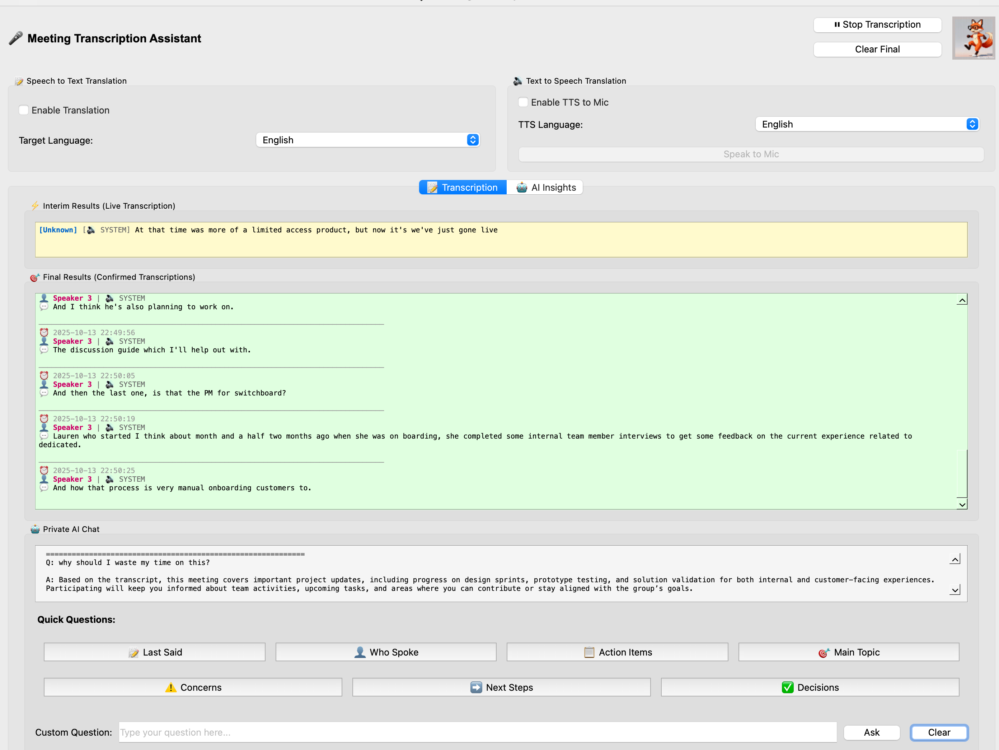

# AI-Powered Meeting Assistant 🦊



An intelligent meeting assistant that combines real-time transcription with AI-powered insights to enhance meeting productivity and capture important information automatically. Built by Team Clever Foxes for the Kata.ai challenge.

> **📢 Important:** To capture audio from meeting apps (Teams, Zoom, etc.), you need to configure virtual audio devices. See the **[Audio Device Setup Guide](AUDIO_DEVICE_SETUP.md)** for complete instructions with screenshots.

## Table of Contents

- [Features](#features)
- [Quick Start](#quick-start)
- [Prerequisites & Setup](#prerequisites--setup)
- [How It Works](#how-it-works)
- [Usage Modes](#usage-modes)
- [Configuration](#configuration)
- [Output & File Organization](#output--file-organization)
- [Virtual Audio Setup](#virtual-audio-setup)
- [Troubleshooting](#troubleshooting)
- [Architecture](#architecture)
- [Development](#development)

---

## Features

### 🎤 Speech Transcription During Meetings

**Real-time speech recognition with advanced features:**

- **Streaming Recognition**
  - Direct Azure Speech Service integration with minimal delay
  - Continuous audio streaming for instant transcription
  - See results appear as you speak
- **Multi-language Support**

  - Auto-detects and switches between languages dynamically
  - Supports 100+ languages including English, Russian, Turkish, Spanish, Hungarian, Hindi, Hebrew
  - Configurable language sets (standard 3 languages or extended up to 30+ languages)
  - Custom language detection profiles

- **Speaker Diarization**

  - Automatically identifies and distinguishes between multiple speakers
  - Labels speakers as "Speaker 0", "Speaker 1", etc.
  - Tracks who said what throughout the meeting
  - Supports 2-10 simultaneous speakers

- **Dual Audio Capture**
  - Records both microphone (your voice) and system audio (meeting participants)
  - Captures audio from any meeting platform (Teams, Zoom, Telegram, etc.)
  - Virtual audio device support for system audio routing
- **Live Progress Indicators**
  - Interim results: See transcription in real-time as you speak (before phrase completion)
  - Visual feedback with color-coded displays (yellow for interim, green for final)
  - Real-time confidence indicators

### 🌍 Translation & Text-to-Speech

**Near real-time oral translation from microphone with dynamic control:**

- **LLM-Powered Translation**

  - Azure OpenAI GPT-4 for accurate, context-aware translations
  - Supports multiple language pairs (English ↔ Russian ↔ Turkish ↔ Spanish, etc.)
  - Natural, conversational translation style

- **Text-to-Speech Integration**

  - Azure TTS with neural voices for natural-sounding speech
  - Automatic voice selection for target language
  - High-quality audio generation

- **Virtual Microphone Routing**

  - Routes TTS audio directly to meeting app microphone input
  - Your peers hear translations as if you spoke them
  - Dual audio output: meeting app + your speakers (you hear it too)
  - Complete setup guide for virtual audio devices (BlackHole, VB-Cable, etc.)

- **Dynamic On/Off Toggle**

  - Enable/disable translation mid-session without stopping transcription
  - Toggle TTS checkbox anytime during active meeting
  - Automatic buffer cleanup when disabled
  - Smart button states: "Generating..." → "Speak to Mic" → "Stop Speaking"

- **User-Controlled Playback**
  - Manual trigger: press "Speak to Mic" button when ready
  - Can interrupt mid-playback with "Stop Speaking"
  - Non-blocking: UI stays responsive during generation
- **Translation Display**
  - Dedicated translation window with blue background color-coding
  - Timestamps for each translation
  - Persistent history throughout session

### 🤖 AI-Powered Meeting Intelligence

**Automatic insight generation during meetings:**

- **Smart Follow-up Questions**

  - AI automatically suggests relevant questions to clarify or expand on topics
  - Helps maintain meeting momentum
  - Identifies missing information or unclear points

- **Key Points Extraction**

  - Identifies and highlights important information from conversations
  - Filters out small talk and focuses on substance
  - Real-time updates as discussion progresses

- **Action Items Tracking**

  - Captures tasks, commitments, and assignments mentioned during meetings
  - Identifies responsible parties
  - Tracks deadlines and dependencies

- **Decision Recording**

  - Automatically identifies and logs decisions made during discussions
  - Captures context around decision-making
  - Helps prevent decision drift

- **Real-time Insights**

  - AI analysis saved to individual text files as they're generated
  - Separate files for each insight type (follow-up questions, key points, action items, decisions)
  - Timestamped entries for chronological tracking

- **Meeting Summaries**

  - Generates comprehensive summaries with key outcomes and insights
  - Multiple export formats: JSON (data), Markdown (human-readable), text files
  - Includes statistics and metadata

- **Duplicate Prevention**
  - Smart comparison prevents repetitive AI suggestions
  - Improves insight quality and reduces noise

### 💬 Private AI Chat

**Advanced conversational AI with memory and context awareness:**

- **Conversation Memory** 🧠

  - AI remembers previous questions and answers throughout the session
  - Maintains context across multiple conversation turns (up to 10 turns)
  - Can reference earlier parts of the conversation for better responses
  - Memory automatically expires after 24 hours for privacy

- **Live Transcript Context**

  - Ask questions about the ongoing meeting in real-time
  - AI analyzes recent conversation history (up to 3000 characters)
  - Understands speaker attribution and context
  - Seamlessly integrates meeting transcript with conversation memory

- **Quick Question Buttons**

  - 📝 **Last Said** - What was just discussed?
  - 👤 **Who Spoke** - Who was the last speaker?
  - 📋 **Action Items** - What tasks were mentioned?
  - 🎯 **Main Topic** - What's the main discussion?
  - ⚠️ **Concerns** - What issues were raised?
  - ➡️ **Next Steps** - What are the plans?
  - ✅ **Decisions** - What was decided?

- **Custom Questions**

  - Type any question about meeting content or general topics
  - Natural language understanding with conversation continuity
  - Context-aware responses that build on previous exchanges
  - Follow-up questions work naturally with conversation memory

- **Non-blocking Processing**

  - Questions processed in background threads
  - UI stays responsive during AI processing
  - Multiple questions can be queued

- **Persistent History**

  - All Q&A saved to `private-chat-history.txt` in session folder
  - Review conversations later with full context
  - Timestamped question types and conversation flow
  - Memory stats and session duration tracking

- **Session History Review**
  - Browse chat history from past meetings
  - Search across multiple sessions

### 📊 Advanced Session Management

**Comprehensive meeting organization and analytics:**

- **Session-based Tracking**

  - Each meeting creates isolated folder with timestamp
  - Automatic organization by date and time
  - No conflicts between concurrent sessions

- **Visual Insights Dashboard (GUI)**

  - Two-tab interface: Transcription + AI Insights
  - Color-coded insight sections with resizable panels
  - Real-time updates during active meetings

- **Session History Browser (GUI)**

  - 🔴 LIVE Session button for current meeting
  - List all past meetings sorted by most recent
  - Session statistics: duration, insight counts, metadata

- **Smart Date Filtering (GUI)**

  - Calendar picker to filter sessions by specific date
  - "All" button to show all sessions
  - Quick access to recent meetings

- **Live vs. Historical View (GUI)**

  - Toggle between current meeting and past sessions
  - Seamless switching without losing context
  - Browse previous insights while in active meeting

- **Auto-pause Feature**

  - Automatically pauses after configurable silence period (default: 60 seconds)
  - Saves Azure costs during breaks
  - Visual indication of pause state

- **Multiple Export Formats**

  - JSON for programmatic access
  - Markdown for human-readable reports
  - Individual text files for each insight type
  - Structured session folders for easy archival

- **Comprehensive Analytics**
  - Meeting duration tracking
  - Word count statistics
  - Speaker participation metrics
  - Insight generation counts

**📖 See [Audio Device Setup Guide](AUDIO_DEVICE_SETUP.md) for complete virtual audio configuration and troubleshooting.**

### 🎛️ Additional Features

- **Audio File Transcription**: Standalone script to transcribe pre-recorded audio files (OGG, MP3, WAV, etc.)
- **Cross-platform GUI**: Works on macOS, Windows, and Linux with PyQt6
- **Session Timer**: Visual timer showing meeting duration
- **API Status Indicators**: Real-time Azure service connection status
- **Configurable Settings**: Extensive configuration options via `config.py` and `.env`
- **Demo Mode**: Test all features without microphone input

---

## Quick Start

### 1. Install Dependencies

```bash
uv sync
```

### 2. Configure Environment

Create a `.env` file in the project root:

```env
# Required: Azure Speech Service
AZURE_SPEECH_SERVICE_KEY=your_speech_service_key
AZURE_SPEECH_SERVICE_REGION=your_region  # e.g., "eastus"

# Required: Azure OpenAI (for AI insights)
AZURE_OPENAI_ENDPOINT=your_openai_endpoint
AZURE_OPENAI_API_KEY=your_openai_api_key

# Optional: Language Configuration
SPEECH_LANGUAGE=auto  # "auto", "en-US", "ru-RU", "tr-TR", etc.

# Optional: Custom Log File Path
TRANSCRIPTION_LOG_FILE=transcriptions.log
```

### 3. Run the Application

**Console Mode (Recommended for first-time users):**

```bash
python main.py
```

**GUI Mode (Cross-platform with translation):**

```bash
python gui_app.py
```

**Demo Mode (No microphone needed):**

```bash
python demo.py
```

### 4. Stop and Generate Summary

- **Console Mode**: Press `Ctrl+C`
- **GUI Mode**: Click "Stop Transcription" button

Summary files will be automatically saved in `sessions/session_YYYYMMDD_HHMMSS/`

---

## Prerequisites & Setup

### Required Services

1. **Azure Speech Service**

   - Sign up at [Azure Portal](https://portal.azure.com)
   - Create a "Speech" resource
   - Note your API Key and Region
   - Used for: Real-time transcription with speaker diarization

2. **Azure OpenAI Service**
   - Create "OpenAI" resource in Azure Portal
   - Deploy GPT-4 model
   - Note your Endpoint and API Key
   - Used for: AI-powered meeting insights and analysis

### System Requirements

- **Python**: 3.10 or higher
- **Operating System**: macOS, Windows, or Linux
- **Microphone**: Built-in or external (required)
- **Internet**: Stable connection for Azure services
- **Virtual Audio Device**: Optional but recommended for system audio capture
  - macOS: BlackHole
  - Windows: VB-Cable or VoiceMeeter
  - See [Virtual Audio Setup](#virtual-audio-setup) for details

### Cost Estimation

**Azure Speech Service:**

- Standard: ~$1 per hour of audio transcribed
- Streaming recognition charges per minute processed

**Azure OpenAI Service:**

- GPT-4: ~$0.03 per 1K tokens (input) + $0.06 per 1K tokens (output)
- Average 1-hour meeting: ~$0.50-2.00 depending on analysis frequency

**Example 1-hour meeting total cost: ~$1.50-3.00**

---

## How It Works

### Architecture Overview

```
┌─────────────────┐     ┌─────────────────┐
│   Microphone    │     │  System Audio   │
│     Input       │     │  (Virtual Dev)  │
└────────┬────────┘     └────────┬────────┘
         │                       │
         └───────────┬───────────┘
                     │
         ┌───────────▼───────────┐
         │   Audio Streaming     │
         │   (PyAudio)          │
         └───────────┬───────────┘
                     │
         ┌───────────▼───────────┐
         │  Azure Speech API     │
         │  (Real-time Stream)   │
         │  - Transcription      │
         │  - Diarization        │
         │  - Language Detection │
         └───────────┬───────────┘
                     │
         ┌───────────▼───────────┐
         │ Meeting Assistant     │
         │ Service               │
         │  - Context Building   │
         │  - AI Analysis Queue  │
         └───────────┬───────────┘
                     │
         ┌───────────▼───────────┐
         │  Azure OpenAI         │
         │  (GPT-4)             │
         │  - Follow-up Q's      │
         │  - Key Points         │
         │  - Action Items       │
         │  - Decisions          │
         └───────────┬───────────┘
                     │
         ┌───────────▼───────────┐
         │   Output Layer        │
         │  - Console Display    │
         │  - Log Files          │
         │  - Session Files      │
         │  - JSON/Markdown      │
         └───────────────────────┘
```

### Core Components

<<<<<<< HEAD
| Component                | File                                                     | Purpose                              |
| ------------------------ | -------------------------------------------------------- | ------------------------------------ |
| **Main Application**     | `main.py`                                                | Console-based orchestrator           |
| **GUI Application**      | `gui_app.py`                                             | Cross-platform GUI with PyQt6        |
| **Speech Transcriber**   | `services/speech_engine/azure_speech_service.py`        | Azure Speech Service integration     |
| **Meeting Assistant**    | `services/llm/meeting_assistant_service.py`             | AI analysis orchestration            |
| **Private Chat Service** | `services/llm/private_chat_service.py`                  | Private AI chat with transcript context |
| **Summary Manager**      | `services/llm/summary_manager.py`                       | Session & file management            |
| **Transcription Logger** | `services/speech_engine/stt/transcription_logger.py`    | Enhanced logging with formatting     |
| **Transcription Service**| `services/speech_engine/stt/transcription_service.py`   | Hybrid transcription with VAD        |
| **Audio Recorder**       | `services/audio/audio_recorder.py`                      | Multi-device audio handling          |
| **Audio Mixer**          | `services/audio/audio_mixer.py`                         | Real-time audio mixing for TTS       |
| **VAD Detector**         | `services/audio/vad_detector.py`                        | Voice Activity Detection             |
| **TTS Controller**       | `services/speech_engine/tts/translation_tts_controller.py` | Translation TTS pipeline coordinator |
| **TTS Voice Manager**    | `services/speech_engine/tts/tts_voice_manager.py`       | TTS voice configuration management   |
| **TTS Audio Buffer**     | `services/speech_engine/tts/tts_audio_buffer.py`        | Audio generation and buffering       |
| **TTS Audio Router**     | `services/speech_engine/tts/tts_audio_router.py`        | Virtual mic audio routing            |
| **LLM Service**          | `services/llm/llm_service.py`                           | Azure OpenAI communication           |
| **Prompts**              | `services/llm/prompts.py`                               | AI prompt templates                  |
| **Configuration**        | `config.py`                                              | Centralized settings                 |
=======
| Component                | File                                                     | Purpose                              |
| ------------------------ | -------------------------------------------------------- | ------------------------------------ |
| **Main Application**     | `main.py`                                                | Console-based orchestrator           |
| **GUI Application**      | `gui_app.py`                                             | Cross-platform GUI with PyQt6        |
| **Speech Transcriber**   | `services/speech_engine/azure_speech_service.py`        | Azure Speech Service integration     |
| **Meeting Assistant**    | `services/llm/meeting_assistant_service.py`             | AI analysis orchestration            |
| **Private Chat Service** | `services/llm/private_chat_service.py`                  | Private AI chat with transcript context |
| **Summary Manager**      | `services/llm/summary_manager.py`                       | Session & file management            |
| **Transcription Logger** | `services/speech_engine/stt/transcription_logger.py`    | Enhanced logging with formatting     |
| **Transcription Service**| `services/speech_engine/stt/transcription_service.py`   | Hybrid transcription with VAD        |
| **Audio Recorder**       | `services/audio/audio_recorder.py`                      | Multi-device audio handling          |
| **Audio Mixer**          | `services/audio/audio_mixer.py`                         | Real-time audio mixing for TTS       |
| **VAD Detector**         | `services/audio/vad_detector.py`                        | Voice Activity Detection             |
| **TTS Controller**       | `services/speech_engine/tts/translation_tts_controller.py` | Translation TTS pipeline coordinator |
| **TTS Voice Manager**    | `services/speech_engine/tts/tts_voice_manager.py`       | TTS voice configuration management   |
| **TTS Audio Buffer**     | `services/speech_engine/tts/tts_audio_buffer.py`        | Audio generation and buffering       |
| **TTS Audio Router**     | `services/speech_engine/tts/tts_audio_router.py`        | Virtual mic audio routing            |
| **LLM Service**          | `services/llm/llm_service.py`                           | Azure OpenAI communication           |
| **Prompts**              | `services/llm/prompts.py`                               | AI prompt templates                  |
| **Configuration**        | `config.py`                                              | Centralized settings                 |
>>>>>>> e01e29b (re-orgranization of)

### AI Analysis Pipeline

1. **Audio Capture** → Continuous streaming from microphone and/or system audio
2. **Transcription** → Real-time speech-to-text via Azure Speech Service
3. **Context Building** → Recent conversation history maintained for analysis
4. **AI Processing** → Azure OpenAI analyzes text when sufficient context available
5. **Insight Generation** → Follow-up questions, key points, action items, decisions
6. **Storage** → Insights saved to individual text files + comprehensive summaries
7. **Display** → Real-time console/GUI output with visual formatting

---

## Usage Modes

### Console Mode (`main.py`)

**Best for:** Production use, server deployment, automation

**Features:**

- Lightweight, no GUI dependencies
- Color-coded console output
- Real-time transcription display
- AI insights as they're generated
- Ctrl+C to stop and generate summary

**Output Example:**

```
🎯 TRANSCRIPTION RESULT
💬 We need to finalize the project timeline by next week
⏰ 2025-10-11 14:23:15 | 🎤 MICROPHONE | 👤 Speaker 1

🤖 AI FOLLOW-UP QUESTIONS
💭 1. What are the key milestones for the project timeline?
💭 2. Who will be responsible for each phase?
💭 3. What dependencies might affect the timeline?

📝 KEY POINTS IDENTIFIED
• Project timeline needs finalization
• Deadline: Next week
```

### GUI Mode (`gui_app.py`)

**Best for:** Interactive use, demonstrations, translation needs, reviewing past meetings

**Features:**

- Cross-platform (macOS, Windows, Linux)
- **Two-Tab Interface**: Transcription + AI Insights
- Real-time AI insights visualization
- Browse and filter past session insights
- Real-time translation with language selector
- Start/stop buttons with visual feedback
- Session timer and statistics
- Auto-pause after silence period

#### 📝 Transcription Tab

**Windows:**

- **Interim Results**: Yellow background, updates as you speak
- **Final Results**: Green background, confirmed transcriptions
- **Translation**: Blue background, LLM-translated text (when enabled)

**Controls:**

- ▶ Start Transcription
- ⏸ Stop Transcription
- ☑ Enable Translation (checkbox)
- Language selector (English, Russian, Turkish)
- **Speak Translation** button (routes TTS to virtual mic)

#### 🤖 AI Insights Tab

**Visual AI Insights Management**

The AI Insights tab provides a comprehensive view of meeting intelligence with powerful browsing and filtering capabilities.

**Layout:**

- **Left Panel**: Session browser with date filtering
- **Right Panel**: Four color-coded insight sections (resizable)

**Session Browser Features:**

- **🔴 LIVE Session Button**: View current meeting insights in real-time
- **Session List**: All past meetings sorted by most recent
- **Date Filter**: Calendar picker to filter sessions by date
- **"All" Button**: Clear filter to show all sessions
- **Session Stats**: Duration, insight counts, and metadata

#### 🤖 Private AI Chat Section

**Located at the bottom of the Transcription tab**, the Private AI Chat provides intelligent conversational assistance with memory and context awareness.

**How to Use:**

1. **Start Transcription**: The chat interface appears automatically with memory status indicator
2. **Quick Questions**: Click any button for instant answers:
   - 📝 Last Said - What was just discussed?
   - 👤 Who Spoke - Who was the last speaker?
   - 📋 Action Items - What tasks were mentioned?
   - 🎯 Main Topic - What's the main discussion?
   - ⚠️ Concerns - What issues were raised?
   - ➡️ Next Steps - What are the plans?
   - ✅ Decisions - What was decided?
3. **Custom Questions**: Type any question in the text box and press Enter or click "Ask"
   - Ask about meeting content: "What was the budget discussion about?"
   - Ask general questions: "What's the capital of France?"
   - Follow-up questions: "What about the timeline?" (AI remembers previous context)
4. **Memory Management**:
   - View real-time memory status (🧠 Memory: X messages)
   - Click "🧹 Clear Memory" to reset conversation context
   - Memory automatically expires after 24 hours
5. **View History**: All questions and answers are saved and displayed in the chat window
6. **Review Later**: Switch to past sessions to see their chat history

**Advanced Features:**

- ✅ **Conversation Memory**: AI remembers previous questions and builds context
- ✅ **Dual-Mode Intelligence**: Handles both meeting and general questions appropriately
- ✅ **Context-Aware**: AI analyzes recent transcript and conversation history
- ✅ **Non-Blocking**: UI stays responsive while processing
- ✅ **Memory Management**: Real-time status and manual control
- ✅ **Persistent**: History saved to session folder with conversation flow

### Demo Mode (`demo.py`)

**Best for:** Testing without microphone, demonstrations, development

**Features:**

- Simulates realistic meeting conversation
- No audio input required
- Shows all AI capabilities
- Generates sample output files
- Feature demonstration mode

**Use cases:**

- Test Azure OpenAI integration
- Verify AI prompt effectiveness
- Demo to stakeholders
- Development and debugging

---

## Using TTS Translation Feature

For complete setup instructions, troubleshooting, and advanced configurations, see:

**📖 [Audio Device Setup Guide](AUDIO_DEVICE_SETUP.md)**

### Quick Start

1. **Install BlackHole**: `brew install blackhole-2ch` (restart Mac after)
2. **Configure meeting app**: Set microphone to "BlackHole 2ch"
3. **Enable in app**: Check ☑ "Enable TTS to Microphone"
4. **Select language**: Choose target language from dropdown
5. **Speak**: Wait for translation → Press "Speak to Mic"
6. **Result**: Your peer hears the translation! ✅

### How It Works

```
Your Speech → Transcription → LLM Translation → Azure TTS →
BlackHole Virtual Mic → Meeting App → Peer Hears Translation! 🌍
```

### Dynamic Oral Translation Mode

**The TTS to Microphone feature can be toggled ON and OFF at any time
during an active transcription session**, giving you complete flexibility
over when translations are generated and spoken.

#### Usage Scenarios

**Scenario 1: Normal conversation (TTS OFF)**

- Speak naturally in your language
- Your voice goes directly to meeting participants
- System transcribes your speech normally
- No translations are generated

**Scenario 2: Need translation (TTS ON → Speak → TTS OFF)**

1. **Enable TTS**: Check ☑ "Enable TTS to Microphone" during session
2. **Speak in your language**: System transcribes and translates
3. **Wait for generation**: Button shows "Generating..." → "Speak to Mic"
4. **Press "Speak to Mic"**: Translation plays to meeting participants
5. **Disable TTS**: Uncheck ☑ to return to normal mode
   - Any buffered translations are automatically discarded
   - System returns to passthrough mode

**Scenario 3: Multiple translations in sequence**

- Keep TTS enabled
- Speak → Wait → Press "Speak to Mic" → Speak again
- Each phrase generates a new translation
- Previous translations are replaced when you speak new content

#### Key Features

✅ **Toggle anytime**: Enable/disable TTS checkbox during active session
✅ **No restart needed**: Works mid-session without stopping transcription
✅ **Auto-buffer cleanup**: Disabling TTS discards unspoken translations
✅ **Smart button state**: "Speak to Mic" only enabled when:

- Transcription is running
- TTS checkbox is checked
- Translation audio is ready to play
  ✅ **Interruption safe**: Stop speaking mid-playback with "Stop Speaking"

#### Control Flow

```
┌─────────────────────────────────────────────────┐
│                                                 │
│  TTS Checkbox: ☐ OFF                           │
│  → Your voice passes through normally           │
│  → No translations generated                    │
│  → "Speak to Mic" button: DISABLED             │
│                                                 │
└─────────────────────────────────────────────────┘
                      ↓ ☑ Check TTS
┌─────────────────────────────────────────────────┐
│                                                 │
│  TTS Checkbox: ☑ ON                            │
│  → Transcription + Translation active           │
│  → Translations buffered as you speak           │
│  → "Speak to Mic" button: ENABLED when ready   │
│                                                 │
└─────────────────────────────────────────────────┘
                      ↓ Press "Speak to Mic"
┌─────────────────────────────────────────────────┐
│                                                 │
│  Speaking to Meeting Participants               │
│  → Translation playing through virtual mic      │
│  → Button shows "Stop Speaking" (enabled)       │
│  → Can interrupt by clicking button             │
│                                                 │
└─────────────────────────────────────────────────┘
                      ↓ ☐ Uncheck TTS
┌─────────────────────────────────────────────────┐
│                                                 │
│  Cleanup Automatically:                         │
│  → Playback stopped (if active)                 │
│  → Buffered translations discarded              │
│  → Return to normal passthrough mode            │
│  → "Speak to Mic" button: DISABLED             │
│                                                 │
└─────────────────────────────────────────────────┘
```

#### Best Practices

1. **Test before meeting**: Enable TTS and say a test phrase to verify
   routing works
2. **Disable when not needed**: Keep TTS off during normal conversation
   to save Azure costs
3. **Watch the button**: "Generating..." means wait, "Speak to Mic" means
   ready
4. **Short phrases work best**: System generates translations faster for
   shorter utterances
5. **Check language selector**: Ensure target language is correct before
   enabling TTS

---

## Configuration

### Language Settings

**Auto-detection (default):**

```python
# config.py
SPEECH_LANGUAGE = "auto"
CANDIDATE_LANGUAGES = ["en-US", "ru-RU", "tr-TR"]
```

**Specific language:**

```python
SPEECH_LANGUAGE = "en-US"  # English
SPEECH_LANGUAGE = "ru-RU"  # Russian
SPEECH_LANGUAGE = "tr-TR"  # Turkish
```

**Supported languages:** [See Azure documentation](https://learn.microsoft.com/en-us/azure/ai-services/speech-service/language-support)

### Audio Settings

```python
# config.py - AudioSettings class
CHUNK_DURATION = 5.0      # Recording chunk size (seconds)
SAMPLE_RATE = 16000       # Audio sample rate (Hz) - Azure requires 16kHz
CHUNK_SIZE = 1024         # Audio buffer size
MIN_AUDIO_LENGTH = 1000   # Min bytes to attempt transcription
```

### Logging Settings

```python
# config.py - LogSettings class
LOG_FILE = "transcriptions.log"  # Can override with env var
SHOW_INTERIM_RESULTS = True      # Show partial transcriptions
```

**Environment override:**

```bash
export TRANSCRIPTION_LOG_FILE=/path/to/custom.log
```

### Speaker Diarization

```python
# config.py - AzureSpeechService class
ENABLE_DIARIZATION = True   # Enable speaker identification
MIN_SPEAKERS = 2            # Minimum expected speakers
MAX_SPEAKERS = 10           # Maximum expected speakers
```

### Session Settings

```python
# config.py - SessionSettings class
AUTO_PAUSE_SILENCE_DURATION = 60  # Auto-pause after 60 seconds of silence
ENABLE_AUTO_PAUSE = True          # Enable auto-pause feature
```

---

## Output & File Organization

### Session-Based Structure

Each meeting creates a unique session folder with timestamp:

```
sessions/
├── session_20251011_143022/
│   ├── transcriptions.log                       # All spoken text with timestamps
│   ├── meeting_summary_20251011_143022.json     # Comprehensive data
│   ├── meeting_summary_20251011_143022.md       # Human-readable report
│   ├── follow-up-questions.txt                  # AI-generated questions
│   ├── key-points.txt                           # Important topics
│   ├── action-items.txt                         # Tasks and assignments
│   ├── decisions.txt                            # Recorded decisions
│   └── private-chat-history.txt                 # Private AI chat Q&A history
├── session_20251011_150115/
│   └── ...
└── session_20251011_160245/
    └── ...
```

### File Descriptions

**`transcriptions.log`**

- Plain text with timestamps
- Source identification (microphone vs system audio)
- Speaker labels when diarization enabled
- Easy to parse and analyze

**Format:**

```
[2025-10-11 14:23:15] [🎤 MICROPHONE] [👤 Speaker 1] Hello everyone
[2025-10-11 14:23:18] [🔊 SYSTEM_AUDIO] [👤 Speaker 2] Hi there
```

**`meeting_summary_YYYYMMDD_HHMMSS.json`**

- Complete session data in JSON format
- All transcriptions with metadata
- AI-generated insights
- Session statistics
- Programmatically accessible

**`meeting_summary_YYYYMMDD_HHMMSS.md`**

- Human-readable meeting report
- Organized sections
- Easy to share and review
- Includes all key information

**Individual insight files** (`*.txt`)

- Real-time insights as they're generated
- Chronological with timestamps
- Separate file for each insight type
- Easy to monitor during meeting

**Example `action-items.txt`:**

```
=== 2025-10-11 14:25:30 ===
1. John to finalize project timeline by Friday
2. Sarah to schedule follow-up meeting with stakeholders
3. Team to review requirements document by EOW

=== 2025-10-11 14:28:45 ===
1. Mike to prepare budget proposal for Q4
```

**`private-chat-history.txt`**

- Private AI chat question and answer history
- Timestamped Q&A pairs
- Includes question type labels
- Review conversations with the AI assistant
- Not included in main meeting summary

**Example `private-chat-history.txt` with conversation memory:**

```
============================================================
[2025-10-11 14:26:15] [last_said]
============================================================
Q: What was the last thing discussed?

A: The team discussed finalizing the project timeline by next Friday.

============================================================
[2025-10-11 14:27:30] [custom]
============================================================
Q: Who is responsible for the budget proposal?

A: Mike is responsible for preparing the budget proposal for Q4.

============================================================
[2025-10-11 14:28:45] [custom]
============================================================
Q: What about the timeline we just discussed?

A: The timeline we discussed earlier needs to be finalized by next Friday. This aligns with Mike's budget proposal deadline for Q4.

============================================================
[2025-10-11 14:29:20] [custom]
============================================================
Q: What's the capital of France?

A: The capital of France is Paris.

============================================================
[2025-10-11 14:30:10] [custom]
============================================================
Q: Going back to the meeting, what are the key deadlines?

A: Based on our earlier discussion, the key deadlines are:
1. Project timeline finalization: Next Friday
2. Mike's Q4 budget proposal: Also due next Friday

These deadlines appear to be coordinated for the same timeframe.
```

### Benefits of Session-Based Organization

✅ **Isolation**: Each meeting completely separate  
✅ **No Conflicts**: Concurrent sessions won't interfere  
✅ **Easy Navigation**: Find meetings by timestamp  
✅ **Clean Git**: All generated files automatically ignored  
✅ **Comprehensive**: All related files in one place  
✅ **Scalable**: Handles unlimited number of sessions

---

## Virtual Audio Setup

To capture system audio (from Zoom, Teams, YouTube, etc.), you need a virtual audio device that routes audio back to an input the app can record.

### macOS Setup (Recommended: BlackHole)

**1. Install BlackHole**

- Download: [BlackHole GitHub](https://github.com/ExistentialAudio/BlackHole)
- Install BlackHole 2ch (2-channel version)
- Restart computer (recommended)

**2. Create Multi-Output Device**

a. Open "Audio MIDI Setup" (Cmd+Space, type "Audio MIDI Setup")

b. Click "+" button → "Create Multi-Output Device"

c. Check both:

- ✅ Your Headset/Speakers (e.g., "AirPods", "Jabra")
- ✅ BlackHole 2ch

d. Click on "BlackHole 2ch" → Check "Drift Correction"

e. Set as system output:

- Right-click "Multi-Output Device" → "Use This Device For Sound Output"
- OR: System Settings → Sound → Output → Multi-Output Device

**3. Test**

```bash
# Say something through system audio
say "Testing audio routing"

# Start the app
python main.py
```

Both your voice and system sounds should be transcribed!

**Audio Flow:**

```
Your Voice → Microphone → App ✅
System Audio → Multi-Output → Speakers ✅ (you hear it)
                           → BlackHole → App ✅ (app captures it)
```

### Windows Setup

**Option 1: VB-Cable** (Simple)

- Download: [VB-Audio VB-Cable](https://vb-audio.com/Cable/)
- Install and restart
- Set VB-Cable as default output in Windows Sound Settings
- Run app, select VB-Cable as system audio source

**Option 2: VoiceMeeter** (Advanced)

- Download: [VoiceMeeter](https://vb-audio.com/Voicemeeter/)
- More control over audio routing
- Professional-grade features
- Follow setup wizard

### Meeting App Compatibility

**Browser-based meetings (✅ Full Support):**

- Microsoft Teams (Web)
- Zoom (Web)
- Google Meet
- Any browser-based meeting platform

**Desktop apps (⚠️ Limited - See Note Below):**

- Microsoft Teams (Desktop)
- Zoom (Desktop)
- Discord
- Slack
- Telegram

**⚠️ IMPORTANT:** Desktop meeting apps (Teams, Zoom) use **protected audio streams** that may prevent system audio capture with standard BlackHole/VB-Cable setup.

**Solutions:**

1. **Use browser versions** of meeting apps (Teams Web, Zoom Web) - Works perfectly ✅
2. **Use Loopback** by Rogue Amoeba ($99) for app-specific audio routing - Professional solution ✅
3. **Configure meeting app** to output to BlackHole directly - May lose audio in your speakers ⚠️

**📖 See detailed troubleshooting:** [AUDIO_DEVICE_SETUP.md - Meeting Apps Not Captured](AUDIO_DEVICE_SETUP.md#️-meeting-apps-not-captured-teams-zoom)

**Why this happens:** Meeting apps prioritize audio quality and use exclusive hardware access, bypassing the system audio mixer that BlackHole captures from. Browser audio goes through the regular system mixer and works fine.

**Configuration:**

- Keep normal microphone in meeting app
- Multi-Output handles routing at system level
- For desktop apps, additional configuration may be needed (see guide)

---

## Troubleshooting

### Common Issues

**Problem: "AZURE_SPEECH_SERVICE_KEY not set"**

- ✅ Check `.env` file exists in project root
- ✅ Verify key is correct (no extra spaces)
- ✅ Restart application after adding key

**Problem: No system audio captured**

- ✅ Verify Multi-Output Device is system default
- ✅ Check BlackHole is included in Multi-Output
- ✅ Test with: `say "testing"` (macOS) or YouTube video
- ✅ Restart app after changing audio settings

**Problem: YouTube works but Teams/Zoom desktop app doesn't**

- ⚠️ This is a **known limitation** - meeting apps use protected audio streams
- ✅ **Solution 1 (Best)**: Use browser versions (teams.microsoft.com, zoom.us/join)
- ✅ **Solution 2**: Install Loopback by Rogue Amoeba for app-specific routing
- ✅ **Solution 3**: Configure meeting app to output to BlackHole directly
- 📖 See detailed guide: [AUDIO_DEVICE_SETUP.md](AUDIO_DEVICE_SETUP.md#️-meeting-apps-not-captured-teams-zoom)

**Problem: TTS translation issues**

- See detailed troubleshooting in [Audio Device Setup Guide](AUDIO_DEVICE_SETUP.md#troubleshooting)
- ✅ Verify meeting app microphone is set to "BlackHole 2ch"
- ✅ Check BlackHole is installed: `brew list blackhole-2ch`
- ✅ Restart meeting app after changing audio device

**Problem: Wrong language detected**

- ✅ Set specific language: `SPEECH_LANGUAGE=en-US` in `.env`
- ✅ Adjust `CANDIDATE_LANGUAGES` in `config.py`
- ✅ Use fewer candidate languages for faster detection

**Problem: No AI insights generated**

- ✅ Check Azure OpenAI credentials in `.env`
- ✅ Verify internet connection
- ✅ Check if text meets minimum length (`min_text_length`)
- ✅ Look for errors in console output

**Problem: Audio quality issues**

- ✅ Enable "Drift Correction" in Multi-Output Device
- ✅ Match sample rates (48000 Hz recommended)
- ✅ Use headphones to prevent echo/feedback
- ✅ Check microphone permissions in System Settings

**Problem: High Azure costs**

- ✅ Use specific language instead of auto-detection
- ✅ Monitor usage in Azure Portal
- ✅ Set up spending limits
- ✅ Use demo mode for testing

### Monitoring Tools

**View live transcription log:**

```bash
tail -f sessions/session_YYYYMMDD_HHMMSS/transcriptions.log
```

**Search by speaker:**

```bash
grep "MICROPHONE" transcriptions.log
grep "Speaker 1" transcriptions.log
```

**Watch for errors:**

```bash
python main.py 2>&1 | tee debug.log
```

**Check Azure connection:**

```bash
python -c "from azure_speech_service import AzureSpeechTranscriber; AzureSpeechTranscriber()"
```

---

## Architecture

### Design Principles

- **Streaming First**: Direct Azure API integration for minimal latency
- **Separation of Concerns**: Each component has single responsibility
- **Modular Architecture**: Organized service packages by functionality
- **Thread Safety**: Async processing with proper synchronization
- **Cloud Native**: Leverages Azure services for scalability
- **Session Isolation**: Complete separation between meetings
- **Extensibility**: Easy to add new AI features or output formats

### Module Organization

The codebase is organized into logical service packages:

**🎵 Audio Services (`services/audio/`)**
- Audio capture, recording, and mixing functionality
- Voice Activity Detection (VAD)
- Real-time audio processing for TTS integration

**🗣️ Speech Engine (`services/speech_engine/`)**
- Azure Speech Service integration
- **STT (Speech-to-Text)**: Transcription services and logging
- **TTS (Text-to-Speech)**: Translation, voice management, and audio routing

**🤖 LLM Services (`services/llm/`)**
- Language model integration and AI analysis
- Meeting assistance, private chat, and summary management
- Prompt templates and conversation handling

**Benefits of this structure:**
- ✅ **Logical Grouping**: Related functionality organized together
- ✅ **Dependency Management**: Clear separation of concerns
- ✅ **Maintainability**: Easy to locate and modify specific features
- ✅ **Scalability**: Simple to add new services within existing categories
- ✅ **Testing**: Isolated modules are easier to test independently

### Technology Stack

**Core:**

- Python 3.10+
- PyAudio for audio capture
- Azure Cognitive Services SDK

**Azure Services:**

- Azure Speech Service (Speech-to-Text with diarization)
- Azure OpenAI Service (GPT-4 for insights)

**GUI:**

- PyQt6 (cross-platform)
- Thread-safe signal/slot architecture

**Dependencies:**

- `azure-cognitiveservices-speech` - Speech recognition
- `openai` - OpenAI SDK for Azure
- `pyaudio` - Audio I/O
- `python-dotenv` - Environment configuration
- `colorama` - Console colors
- `pytest` - Testing framework

### Smart Features

**Context Building:**

- Maintains sliding window of recent conversation
- AI sees full context for better insights
- Configurable history length

**Duplicate Prevention:**

- Smart comparison of AI-generated content
- Avoids repetitive suggestions
- Improves insight quality

**Real-time Processing:**

- Non-blocking AI analysis
- Separate threads for transcription and insights
- Queue-based architecture

**Session Management:**

- Automatic timestamp-based folders
- All related files grouped together
- Easy cleanup and archival

---

## Development

### Project Structure

```
kata_ai.meeting_assistant.clever_foxes/
├── main.py                      # Console application entry point
├── gui_app.py                   # GUI application entry point
├── demo.py                      # Demo without audio input
├── config.py                    # Centralized configuration
├── pyproject.toml               # Dependencies (uv)
├── .env                         # Environment variables (create this)
├── services/                    # Organized service modules
│   ├── audio/                   # Audio processing services
│   │   ├── audio_mixer.py       # Real-time audio mixing for TTS
│   │   ├── audio_recorder.py    # Multi-device audio handling
│   │   └── vad_detector.py      # Voice Activity Detection
│   ├── speech_engine/           # Speech processing services
│   │   ├── azure_speech_service.py  # Azure Speech Service integration
│   │   ├── stt/                 # Speech-to-Text services
│   │   │   ├── transcription_service.py   # Hybrid transcription with VAD
│   │   │   └── transcription_logger.py    # Enhanced logging
│   │   └── tts/                 # Text-to-Speech services
│   │       ├── translation_tts_controller.py  # TTS pipeline coordinator
│   │       ├── tts_audio_buffer.py           # Audio generation and buffering
│   │       ├── tts_audio_router.py           # Virtual mic audio routing
│   │       ├── tts_voice_manager.py          # Voice configuration management
│   │       └── tts_voices.yml               # Voice configuration data
│   └── llm/                     # Language Model services
│       ├── llm_service.py       # Azure OpenAI communication
│       ├── meeting_assistant_service.py  # AI analysis orchestration
│       ├── private_chat_service.py       # Private AI chat service
│       ├── prompts.py           # AI prompt templates
│       └── summary_manager.py   # Session and file management
├── tests/                       # Test suite
│   ├── test_llm_communicator.py
│   └── test_meeting_assistant.py
├── sessions/                    # Generated session folders (gitignored)
└── static/                      # GUI assets
    ├── fox.png
    └── dancing_fox.gif
```

### Running Tests

```bash
# Run all tests
pytest

# Run specific test file
pytest tests/test_meeting_assistant.py

# Run with verbose output
pytest -v

# Run specific test
pytest tests/test_llm_communicator.py::TestLLMCommunicator::test_basic_interaction
```

### Code Quality

**Linting:**

```bash
# Run linters (add to pyproject.toml as needed)
ruff check .
```

**Type Checking:**

```bash
mypy *.py
```

### Contributing Guidelines

1. **Branch naming**: `feature/description` or `fix/description`
2. **Commit messages**: Clear and descriptive
3. **Documentation**: Update README for new features
4. **Testing**: Add tests for new functionality
5. **Configuration**: Add new settings to `config.py`

### Future Enhancements

**Planned features:**

- [ ] Multiple simultaneous translations
- [ ] Custom AI prompt templates via UI
- [ ] Meeting calendar integration
- [ ] Participant name recognition
- [ ] Post-meeting email summaries
- [ ] Integration with task management tools
- [ ] Support for additional LLM providers
- [ ] Offline transcription mode
- [ ] Mobile companion app

---

## License & Credits

**Team:** Clever Foxes  
**Challenge:** Kata.ai Meeting Assistant  
**Year:** 2025

**Technologies:**

- Microsoft Azure (Speech Service, OpenAI Service)
- Python & PyQt6
- BlackHole Virtual Audio (macOS)

**Special Thanks:**

- Azure Cognitive Services team
- OpenAI for GPT-4
- PyAudio and PyQt6 communities

---

## Support & Resources

**Documentation:**

- [Azure Speech Service Docs](https://learn.microsoft.com/en-us/azure/ai-services/speech-service/)
- [Azure OpenAI Service Docs](https://learn.microsoft.com/en-us/azure/ai-services/openai/)
- [PyQt6 Documentation](https://www.riverbankcomputing.com/static/Docs/PyQt6/)

**Getting Help:**

1. Check this README thoroughly
2. Review troubleshooting section
3. Check console output for error messages
4. Verify Azure service status
5. Test with demo mode first

**Performance Tips:**

- Use wired internet for stable Azure connection
- Quality microphone improves transcription accuracy
- Close CPU-intensive apps during meetings
- Monitor Azure usage to manage costs
- Use specific languages when possible (faster than auto-detect)

---

**Happy Meeting! 🦊🎤**
